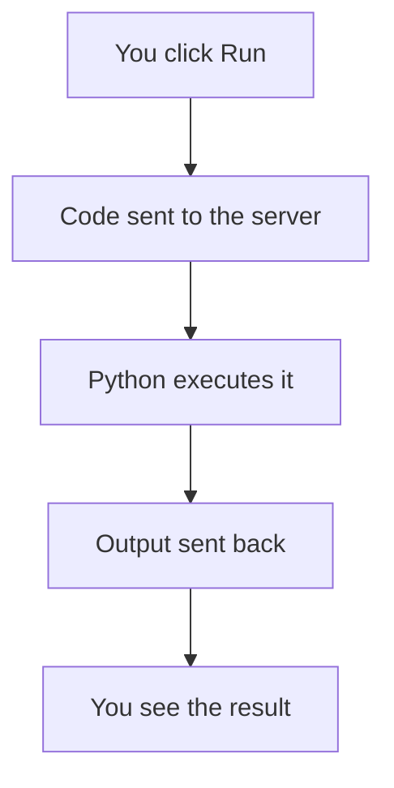

Python is a simple, readable language. To print text to the screen, use the built-in `print()` function — and since this is the first lesson, it also doubles as a demo of everything this page format can do.

> [!TIP]
> Try changing the text inside the quotes on the right, then hit Run.

> [!WARNING]
> Python is case-sensitive — `Print("hi")` raises an error, but `print("hi")` works.

## Why print() matters

Every Python program needs some way to show its results.

| Function | What it does |
| --- | --- |
| `print()` | Writes text to the screen |
| `len()` | Counts items in something |
| `type()` | Tells you what kind of value something is |

## A quick example

```python
print("Hello", "World", sep=", ")
```

That prints `Hello, World` — `sep` controls what goes between multiple arguments.

Calling `print()` itself runs in constant time, $O(1)$, but building a very long string first costs you $O(n)$:

$$
\text{total cost} = O(1) + O(n)
$$

Here's roughly what happens when you click Run:



<Details title="Why does the code run on a server instead of in my browser?">
Running arbitrary code safely is hard — a sandboxed server keeps things like infinite loops or file access from affecting your device.
</Details>

Want to go deeper? The [official Python docs](https://docs.python.org/3/library/functions.html#print) cover every argument `print()` accepts.


<DemoPlayer demos={[
  { label: "print basics", src: "/demo-videos/print-basics.mp4" },
  { label: "f-strings", src: "/demo-videos/f-strings.mp4" }
]} />

Now try it yourself in the editor.
